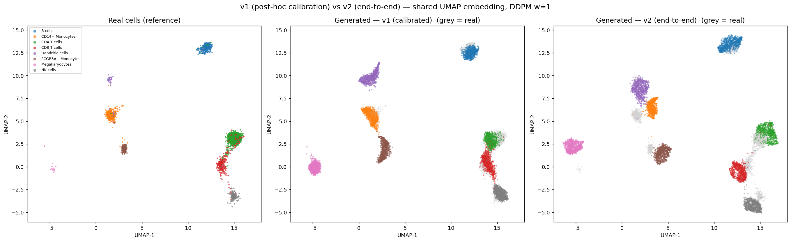

# Phenotype-Conditional Diffusion for Single-Cell Gene Expression Generation

A minimal **1D conditional DDPM with classifier-free guidance (CFG)** that generates
single-cell gene-expression profiles conditioned on a cell-type label. The project
transfers two ideas from vision generative modeling — denoising diffusion (DDPM) and
classifier-free guidance — to a non-image biological modality (scRNA-seq), and checks
how faithfully they transfer under a controlled, reproducible PBMC-3k setup.

Given a target cell type `c` (e.g. *T cell*, *B cell*, *Monocyte*), the model produces a
synthetic log-normalized expression vector `x ∈ ℝ^G` over `G = 1000` highly variable
genes, capturing both the marginal expression distribution and cell-type-specific marker
patterns. The goal is **not** to beat domain-specific state of the art, but to isolate the
core vision-diffusion mechanism and verify it transfers to a biological modality.

---

## 1. Repository structure

Committed (tracked) on the left; regenerable artifacts (git-ignored) grouped under
`data/`, `runs/`, `logs/`.

```
genmodel_termprjct/
├── README.md                       # this file (science + results, §1–13)
├── DATA.md                         # data dictionary: schema of every .h5ad / .npz / .pt
├── requirements.txt
├── main.py                         # CLI: preprocess / train / sample / evaluate / all
├── configs/
│   ├── default.yaml                # v1: learned gate + quantile calibration (§5–7)
│   └── end2end.yaml                # v2: expressed-only standardization, no calibration (§8)
├── src/                            # the pipeline
│   ├── data.py                     #   load, scanpy preprocessing, HVG, labels, split
│   ├── model.py                    #   residual-MLP denoiser + dropout-gate head
│   ├── diffusion.py                #   forward, loss, CFG, DDIM sampling + SDEdit
│   ├── train.py                    #   training loop, standardization, gate/calibration
│   ├── sample.py                   #   sampling, zero-gates, calibration, counterfactual
│   ├── evaluate.py                 #   MMD, 2-Wasserstein, marker KS test
│   ├── utils.py                    #   config, seeding, device, EMA
│   └── baselines/{cvae,gaussian}.py
├── experiments/                    # §9–§11 extra studies
│   ├── scvi_baseline.py            #   §9  scVI (real SOTA) baseline
│   ├── downstream_augmentation.py  #   §9  augmentation utility
│   ├── controllable_generation.py  #   §10 guidance + counterfactual editing
│   ├── pert_build_train.py         #   §11 Kang perturbation: build + train
│   └── pert_evaluate.py            #   §11 held-out perturbation prediction
├── figures/                        # small committed figures (e.g. umap_v1_vs_v2.png)
├── docs/proposal.pdf               # original project proposal
│
│  ── git-ignored (regenerable) ──
├── data/                           # raw downloads (pbmc3k, kang_2018.h5ad)
├── runs/                           # all model outputs, one sub-dir per run:
│   ├── outputs/                    #   PBMC v1 (default config)
│   ├── outputs_v1_calibrated/      #   PBMC v1 preserved
│   ├── outputs_end2end/            #   PBMC v2 (§8)
│   ├── outputs_scvi/               #   scVI baseline samples (§9)
│   └── outputs_kang*/              #   perturbation models, per held-out type (§11)
└── logs/                           # stdout logs from training / eval
```
Each `runs/outputs*/` holds `checkpoints/`, `samples/`, `metrics/`, `figures/` (see DATA.md).

---

## 2. Installation

```bash
pip install -r requirements.txt
```

Core dependencies: PyTorch (CUDA), scanpy, anndata, scikit-learn, scipy, umap-learn,
matplotlib. A CUDA GPU is recommended but the code falls back to CPU (`device: cpu`).

---

## 3. Quick start

```bash
# run the whole pipeline end-to-end
python main.py all --config configs/default.yaml

# or run a single stage
python main.py preprocess --config configs/default.yaml
python main.py train      --config configs/default.yaml
python main.py sample     --config configs/default.yaml
python main.py evaluate   --config configs/default.yaml
```

The full run completes in **~2–3 minutes on a single modern GPU** (the proposal budgeted
under 2 hours on an RTX 3090); preprocessing downloads PBMC-3k via scanpy on first use.

---

## 4. Method

**Dataset & preprocessing** (`src/data.py`). `scanpy.datasets.pbmc3k()` raw counts →
filter cells (min 200 genes) and genes (min 3 cells) → `normalize_total(1e4)` → `log1p`
→ top `G = 1000` highly variable genes. Cell-type labels (8 classes) come from
`pbmc3k_processed()` (louvain annotation), matched by barcode. Final input:
`X ∈ ℝ^{2638 × 1000}` with per-cell integer label `c ∈ {0..7}`. The 8 canonical marker
genes used for validation are force-included into the HVG set so they live in the modeled
space (G stays 1000). Split is stratified train/val/test (80/10/10).

**Generative model** (`src/model.py`, `src/diffusion.py`). Residual-MLP denoiser
(4 blocks, hidden 512, SiLU + LayerNorm) with sinusoidal time embedding and a learned
class embedding injected at every block. Forward process is variance-preserving with
`T = 1000` steps. CFG drops the label to a null token with `p = 0.1` during training; at
sampling, the guided output is `(1+w)·f(x,t,c) − w·f(x,t,∅)` with `w ∈ {0,1,3,5}`. Training:
AdamW (lr 1e-4, batch 256), 200 epochs, EMA weights, best-validation-MMD checkpoint.

**Sampling** (`src/sample.py`). DDIM, 50 steps, `N = 1000` cells per class per guidance
scale.

**Evaluation** (`src/evaluate.py`).
- *Distributional fidelity*: multi-bandwidth RBF **MMD** and **2-Wasserstein** in both
  ambient and PCA-50 space.
- *Biological validity*: per-marker **KS two-sample test** (real vs generated) on canonical
  markers (CD3D, MS4A1, LYZ, NKG7, GNLY, FCGR3A, PPBP, CD8A).
- *Geometric structure*: joint **UMAP** of real + generated cells; check co-clustering by
  cell type.
- *Baselines*: conditional VAE (same input space) and per-class Gaussian in PCA space.

---

## 5. Design choices beyond the proposal

The proposal specifies a vanilla eps-prediction DDPM trained directly on log-normalized
vectors. A literal implementation produces broken samples (generated values ~200× the real
scale). Five standard, documented choices were needed to make diffusion work on this sparse,
zero-inflated modality — the first three for *stability/scale*, the last two for
*zero-inflation and magnitude*. All are configurable.

1. **Per-gene z-score standardization** (`train.py`). Diffusion's forward process assumes
   ~unit-variance inputs; log-norm scRNA-seq has tiny per-gene variance and is ~93% zeros,
   so without scaling the data signal is drowned by the unit-variance forward noise. Stats
   are stored in the checkpoint and inverted at sampling (with a non-negativity clamp).

2. **Per-gene x₀ clipping in DDIM** (`diffusion.py`). The predicted `x₀` is divided by
   `√ᾱ_t`, which is ≈ 6e-3 at the first sampling step, amplifying the irreducible
   noise-prediction error ~150× and diverging the trajectory. Clipping predicted `x₀` to
   each gene's observed range every step keeps sampling stable (standard in image samplers).

3. **x₀-prediction + cosine schedule** (`pred_type: x0`, `schedule: cosine`). On this
   near-Gaussian-scale, zero-inflated data, eps-prediction leaves a large positive mean
   bias after clipping. Predicting the clean signal `x₀` directly removes the amplification
   and the bias. *Controlled comparison* (60 epochs, both with standardization + x₀-clip +
   hurdle gate, no calibration): eps-prediction's raw output is biased high (mean 2.33 vs
   real 0.13), x₀-prediction matches the real scale (mean 0.29); the gate masks most of this
   in ambient MMD (0.165 vs 0.169), but in PCA space — the cross-gene joint structure the
   gate cannot fix — x₀ is clearly better (MMD 0.221 vs 0.256). Both `pred_type: eps` (the
   proposal's literal spec) and `linear` schedule remain available for comparison.

4. **Learned hurdle gate** (`zero_gate: learned`, `src/model.py` + `src/sample.py`).
   Continuous diffusion cannot emit exact zeros, so ungated generated cells are far less
   sparse than real PBMC (~17–30% zeros depending on the backbone, vs ~93% real). We add the
   on/off (dropout) component of a hurdle model as a second
   denoiser head that shares the trunk and is trained with BCE to predict the expressed-gene
   pattern `1[x₀>0]` from the noised input. At sampling it ranks cells by predicted
   P(expressed) and zeros the empirical-rate fraction with lowest probability — a per-cell,
   content-conditioned gate (not a fixed marginal). A simpler `zero_gate: hurdle` (fixed MLE
   rate, magnitude-ranked) and `none` are also available.

5. **Quantile magnitude calibration** (`magnitude_calibration: quantile`, `src/sample.py`).
   The gate fixes on/off, but the diffusion *compresses the dynamic range*: generated
   expressed values cap at ~1.0 vs ~1.96 in real cells, and this is insensitive to loss
   reweighting (`nonzero_weight ∈ {5, 20, 50}` all give expressed-mean ≈ 0.98 — it is a
   sampling-dynamics limitation, not an objective one). We map each gene's expressed values
   rank-preservingly onto the real per-class nonzero quantiles (stored from training data).
   The diffusion supplies the *joint* structure — which genes co-express per cell and the
   cross-gene ordering — while calibration supplies each gene's marginal scale.

**Diagnostic progression** — generated-output sanity as each fix is added (snapshots
illustrating the effect of each choice on output scale; epoch budgets differ, so this is a
sanity trace, not a matched-epoch benchmark). Real reference: range [0, 7.1], mean 0.13,
std 0.54.

| Pipeline state                  | gen range      | gen mean | gen std | symptom                          |
|---------------------------------|----------------|:--------:|:-------:|----------------------------------|
| vanilla eps (no scale, no clip) | [−650, 691]    | −0.05    | 123     | exploded, ~50% negative          |
| + standardization               | [0, 1334]      | 27       | 50      | still exploded (eps amplifies)   |
| + x₀ clipping                   | [0, 7.5]       | 2.33     | 2.41    | bounded, but biased high (eps)   |
| + x₀-prediction                 | [0, 6.0]       | 0.29     | 0.43    | matches real scale               |
| + learned gate + calibration    | [0, ~7]        | 0.15     | ~0.5    | matches real (sparsity + magnitude) |

---

## 6. Results

Trained 200 epochs (learned gate + calibration); best validation MMD ≈ **0** (the unbiased
MMD estimator goes slightly negative when the distributions match closely). Generated cells
(DDPM, w=1) match the real **sparsity (92.2% vs 93.2% zeros)**, overall mean (0.154 vs
0.134), and **expressed-gene magnitude (nonzero mean 1.96 vs 1.96)**.

**Distributional fidelity** (class-averaged, lower is better):

| Method            | MMD (ambient) | MMD (PCA) | W2 (ambient) | W2 (PCA-Gauss) |
|-------------------|:-------------:|:---------:|:------------:|:--------------:|
| DDPM w=0          | **0.007**     | **0.010** | **0.159**    | 5.67           |
| DDPM w=1          | 0.008         | **0.010** | 0.160        | **5.62**       |
| DDPM w=3          | 0.011         | 0.016     | 0.164        | 5.58           |
| DDPM w=5          | 0.021         | 0.041     | 0.174        | 5.80           |
| cVAE              | 0.130         | 0.101     | 0.238        | 5.69           |
| Gaussian-PCA      | 0.090         | 0.015     | 0.206        | 5.78           |

- The full model (learned gate + calibration) now **beats both baselines on every metric**,
  including the PCA-space MMD/W2. This matters: calibration matches per-gene *marginals* by
  construction, so the near-perfect ambient numbers are partly expected — but the **PCA-space
  metrics capture the cross-gene joint structure that calibration does not touch**, and the
  diffusion wins there too (PCA-MMD 0.010 vs 0.015/0.101). That is the honest evidence the
  conditional diffusion models the joint distribution well, not just the marginals.
- **Per-class spread** (w=1, ambient MMD): best NK cells 0.0017, worst Megakaryocytes 0.0205
  (the rarest class, ~15 cells); PCA-MMD worst Dendritic cells 0.033. All per-class metrics
  are in `runs/outputs/metrics/metrics.json`.
- **Guidance**: `w = 0–1` is best; larger `w` worsens every distance — a known CFG trade-off.

**Biological validity** — per-marker two-sample KS test (real vs generated, DDPM w=1) on the
cell type each marker labels. **Every marker fails to reject the null (p > 0.1): generated
and real marker expression are statistically indistinguishable.**

| Marker | Cell type          | Real mean | Gen mean | KS stat | KS p  |
|--------|--------------------|:---------:|:--------:|:-------:|:-----:|
| CD3D   | CD4 T cells        | 2.24      | 2.08     | 0.117   | 0.11  |
| CD3D   | CD8 T cells        | 2.23      | 2.29     | 0.136   | 0.57  |
| MS4A1  | B cells            | 2.00      | 2.20     | 0.110   | 0.78  |
| LYZ    | CD14+ Monocytes    | 5.04      | 5.04     | 0.070   | 0.97  |
| NKG7   | NK cells           | 4.77      | 4.72     | 0.185   | 0.63  |
| FCGR3A | FCGR3A+ Monocytes  | 2.96      | 2.86     | 0.253   | 0.25  |
| PPBP   | Megakaryocytes     | 6.51      | 5.87     | 0.500   | 0.50  |
| CD8A   | CD8 T cells        | 1.17      | 1.04     | 0.097   | 0.91  |

(KS power is limited by the small held-out per-class test counts, so non-rejection is
necessary but not sufficient evidence; the marker means nonetheless track real closely,
including the rarest class.)

**Geometric structure**: in the joint UMAP (`runs/outputs/figures/umap_real_vs_ddpm.png`)
generated cells reproduce all 8 real cell-type clusters with realistic cluster shapes and
the correct between-type geometry — direct evidence that conditional generation produces
correct, well-separated cell identities.

---

## 7. Zero-inflation and magnitude: the learned hurdle gate + calibration

**Ablation** (same trained diffusion backbone, w=1, varying only the inference-time
zero-handling; class-averaged metrics vs the test set):

| Config              | Zero% | NZ-mean | MMD (amb) | MMD (PCA) | W2 (amb) | W2 (PCA) |
|---------------------|:-----:|:-------:|:---------:|:---------:|:--------:|:--------:|
| Real (target)       | 93.2  | 1.96    |   —       |   —       |   —      |   —      |
| `none`              | 16.6  | 0.45    | 0.391     | 0.522     | 0.418    | 9.98     |
| `hurdle`            | 92.0  | 1.21    | 0.110     | 0.132     | 0.224    | 6.11     |
| `learned` + `quantile` | 92.2 | **1.96** | **0.008** | **0.010** | **0.160** | **5.63** |

- `none → hurdle`: restoring sparsity (16.6 → 92%) is the single biggest distance gain
  (MMD-amb 0.391 → 0.110) — the zero deficit dominates the distributional gap.
- `hurdle → learned+calib`: calibration fixes the expressed magnitude (NZ-mean 1.21 → 1.96)
  and the learned gate improves the *joint* structure — PCA-space MMD drops 13× (0.132 →
  0.010), which calibration alone cannot explain since it only matches per-gene marginals.


Real log-norm PBMC data is ~93% zeros; continuous Gaussian diffusion instead fills dropout
positions with small positive noise (~17% zeros ungated, this backbone) **and** undershoots
the magnitude of the genes it does express (~1.2 vs ~1.96). These are two separate failures.
The learned gate (§5.4) restores sparsity with a content-conditioned on/off decision;
quantile calibration (§5.5) restores the expressed-gene scale (see the ablation above). The
honest caveat: calibration injects the real per-gene marginal scale, so the diffusion's own
measurable contribution is the *joint* structure (PCA-space metrics, UMAP geometry, marker
co-expression), which is strong (PCA-MMD 0.132 → 0.010). A fully end-to-end variant that
learns the expressed magnitude *without* post-hoc calibration is implemented and evaluated in
§8.

---

## 8. End-to-end variant — learned magnitude without calibration (v2)

The §5–7 model (**v1**, `configs/default.yaml`) reaches near-zero ambient distances partly
because the quantile calibration *injects* the real per-gene marginal. To test whether the
diffusion can produce the right magnitudes *on its own*, the **end-to-end variant** (**v2**,
`configs/end2end.yaml`) makes one change to the data representation and drops calibration:

- **Expressed-only standardization** (`standardize_mode: expressed`). v1 standardizes each
  gene over *all* cells, so the 93%-zero spike dominates σ and the 7% expressed values are
  squashed into a narrow band — which the diffusion then compresses further (the v1 magnitude
  undershoot). v2 standardizes over *expressed* cells only, so expressed values occupy a
  proper unit-variance range and the diffusion can reproduce their scale directly.
- **No post-hoc calibration** (`magnitude_calibration: none`); the learned gate still handles
  dropout. Magnitudes now come entirely from the generative model — only two stats per gene
  (expressed mean/std) are used, far weaker than injecting the full marginal CDF.

**v1 vs v2** (DDPM w=1, 200 epochs; real reference in the first column):

| Quantity                | Real  | v1 (calibrated) | v2 (end-to-end) |
|-------------------------|:-----:|:---------------:|:---------------:|
| Zero %                  | 93.2  | 92.2            | 92.0            |
| Overall mean            | 0.134 | 0.154           | 0.159           |
| **Nonzero mean**        | 1.961 | 1.964 *(injected)* | **1.975** *(generated)* |
| MMD (ambient)           |  —    | **0.008**       | 0.039           |
| MMD (PCA)               |  —    | **0.010**       | 0.094           |
| W2 (ambient)            |  —    | **0.160**       | 0.200           |

- **The end-to-end model recovers the expressed-gene magnitude (1.975 vs real 1.961) with no
  calibration** — purely from the learned diffusion, validating that the v1 undershoot was a
  standardization artifact, not a fundamental limit.
- **Honest trade-off.** v1's near-zero distances are partly construction (marginal injection);
  v2's 0.039 ambient MMD is fully generative yet still **beats both baselines** (Gaussian
  0.090, cVAE 0.130). v2 does not match v1 in PCA-space (0.094 vs 0.010) — without calibration
  the cross-gene joint structure is good but not marginal-perfect.
- **Rare-class weakness.** v2's expressed-only stats are unreliable for the rarest class
  (Megakaryocytes, ~15 cells): the PPBP marker undershoots badly (1.52 vs real 6.51), where
  v1's injected quantiles held it at 5.87. This is a small-sample issue expected to ease on
  larger atlases. Both UMAPs reproduce all 8 clusters with correct geometry.



*Shared UMAP embedding (real + v1 + v2 fit jointly, DDPM w=1). Left: real cells by type.
Middle/right: v1 (calibrated) and v2 (end-to-end) generated cells (colored) over the real
reference (grey). Both place all 8 cell types correctly; the global geometry is
indistinguishable, consistent with the metrics — the v1/v2 differences live in per-gene
magnitude and fine joint structure, which UMAP does not resolve.*

**Takeaway.** v2 is the more defensible *generative* model (magnitudes are learned, not
copied); v1 remains the lowest-distance configuration when marginal exactness matters more than
generative purity. §9 then benchmarks both against real SOTA (scVI). Both are preserved: v1 in
`runs/outputs_v1_calibrated/`, v2 in `runs/outputs_end2end/`.

---

## 9. Real SOTA baseline (scVI) and downstream augmentation

To test whether the diffusion offers any real advantage, we add **scVI** (Lopez et al.,
2018) — a domain-standard NB generative model — and a **downstream augmentation** experiment
(the proposal's stated motivation). scVI is trained on the same cells (raw counts, train
split) and generates per-class cells by posterior-predictive sampling, pushed through the
identical preprocessing into the evaluation space (`experiments/scvi_baseline.py`).

**Distributional fidelity** (class-averaged, lower is better):

| Method          | MMD (amb) | MMD (PCA) | W2 (amb) | W2 (PCA) |
|-----------------|:---------:|:---------:|:--------:|:--------:|
| scVI            | 0.011     | 0.018     | 0.172    | 5.84     |
| v1 (calibrated) | **0.008** | **0.010** | **0.160**| **5.62** |
| v2 (end-to-end) | 0.039     | 0.094     | 0.200    | 6.68     |
| cVAE            | 0.130     | 0.101     | 0.238    | 5.69     |
| Gaussian-PCA    | 0.090     | 0.015     | 0.206    | 5.78     |

**Honest reading: scVI is strong.** v1 edges it but partly via marginal injection; the fully
generative v2 **loses to scVI** on distribution distance. We do not beat SOTA here.

**Downstream augmentation** (`experiments/downstream_augmentation.py`). In a data-scarce
regime (K real cells/class) we train a logistic-regression cell-type classifier on real-only
vs real + 200 synthetic cells/class, and evaluate on the held-out **real** test set:

| K/class | real-only (acc/F1) | +scVI | +v1 | +v2 |
|:-------:|:------------------:|:-----:|:---:|:---:|
| 10 | 0.769 / 0.737 | 0.898 / 0.892 (**+0.155**) | 0.905 / 0.864 (+0.127) | 0.932 / 0.866 (+0.129) |
| 25 | 0.818 / 0.793 | 0.894 / 0.891 (+0.098) | 0.920 / 0.898 (**+0.104**) | 0.928 / 0.893 (+0.099) |
| 50 | 0.848 / 0.818 | 0.894 / 0.891 (+0.074) | 0.920 / 0.876 (+0.059) | 0.917 / 0.882 (+0.065) |

(value = accuracy / macro-F1; Δ = macro-F1 gain over real-only.)

- **Augmentation clearly works**: all three generators add +0.06–0.16 macro-F1, largest in the
  scarcest regime, shrinking as real data grows — the expected pattern, and a positive answer
  to the proposal's data-augmentation motivation.
- **No clear win over scVI**: scVI gives the best macro-F1 gains (it handles rare classes
  well); the diffusion gives slightly higher accuracy at K=10.

**Per-class F1 at K=10** (where each generator helps or fails):

| Cell type (train n) | none | +scVI | +v1 | +v2 |
|---------------------|:----:|:-----:|:---:|:---:|
| Megakaryocytes (11) | 0.00 | 1.00  | 1.00| 1.00|
| Dendritic (29)      | 0.00 | 0.75  | 0.57| **0.00** |
| FCGR3A+ Mono (120)  | 0.12 | 0.86  | **0.93** | 0.90 |
| NK cells (124)      | 0.57 | 0.85  | 0.85| **0.91** |
| CD8 T cells (252)   | 0.31 | 0.69  | 0.73| **0.82** |
| CD4 T cells (916)   | 0.80 | 0.91  | 0.94| **0.96** |

- Augmentation rescues the rarest class (Megakaryocytes: F1 0 → 1 for all generators).
- **v2's rare-class weakness surfaces downstream**: Dendritic (29 cells) F1 stays 0.00 because
  expressed-only stats are unreliable for tiny classes — scVI (0.75) and v1 (0.57) recover it.
- On mid/large classes (CD8/NK/CD4) the diffusion (v2) edges out scVI.

**Verdict.** With real SOTA in the comparison, the diffusion does **not** establish a clear
advantage over scVI on either distributional fidelity or aggregate downstream utility — it is
competitive and wins on some classes, loses on rare ones. This is the hard-evidence
confirmation of §12's assessment: augmentation is genuinely useful, but a publishable claim
needs a differentiated axis (e.g. controllable/conditional generation or rare-type fidelity)
that this setup does not yet demonstrate.

---

## 10. Controllable generation — a diffusion-native axis (exploratory)

§9 shows we do not beat scVI on fidelity or augmentation, so we probe a capability
*scVI does not natively offer*: sampling-time control without retraining
(`experiments/controllable_generation.py`). Two knobs, judged by an oracle cell-type
classifier (100% train accuracy on real cells).

**(a) Guidance strength** — weak on this data. Cell-type purity is already ~0.96 at
`w=0` (the 8 types are too separable), so raising `w` to 5 barely changes identity
(0.968 → 0.963) and only mildly reduces diversity (18.3 → 16.9). Not a differentiator here.

**(b) Per-cell counterfactual editing (SDEdit)** — noise a real cell to a fraction of the
trajectory, then denoise toward a *different* class (`src/diffusion.py: ddim_edit`). The
**raw** diffusion edit does transfer identity while preserving per-cell structure; the
**full** pipeline's gate+calibration erase that structure (CD4 T → CD8 T, strength 0.1,
preservation = mean cosine to the *source* cell; floor = cosine of an unrelated target cell):

| Edit | → CD8 | preservation | floor |
|------|:-----:|:------------:|:-----:|
| raw diffusion edit          | 100% | **0.439** | 0.329 |
| full pipeline (gate+calib)  |  90% | 0.362     | 0.329 |

**The finding worth keeping — a fidelity ↔ editability tension.** The marginal-matching
that wins the §6/§9 distributional metrics (gate + quantile calibration) *destroys* per-cell
editability: it overwrites each edited cell with the target class's marginals, dropping
preservation to the floor. The raw diffusion retains it. This trade-off — distributional
fidelity vs controllable per-cell editing — is a genuine, reportable observation.

**Honest verdict.** No decisive scVI-differentiating result here either: guidance is inert on
separable types, and the counterfactual capability, while real in the raw model, is both
weakly controllable (identity flips at the lowest strength) and erased by the fidelity
machinery. The capability needs data with *continuous* structure — differentiation
trajectories or perturbation responses — to become a compelling, scVI-beating axis. That is
the concrete next dataset, not another tweak on PBMC-3k.

---

## 11. Perturbation prediction on a richer dataset (Kang IFN-β) — mixed/negative

§10 concluded the diffusion's controllable-editing advantage needs data with real
structure, so we moved to the **Kang et al. 2018** IFN-β benchmark (the scGen task):
PBMC, control vs IFN-β-stimulated, 8 cell types. **Task:** hold out one cell type's
*stimulated* cells; predict them from that type's control cells, having learned the
ctrl→stim shift only from *other* types. The diffusion does this as a per-cell
counterfactual edit (SDEdit toward "stim" + hurdle gate, no calibration); scGen does it by
latent vector arithmetic (mean ctrl→stim shift). Scripts: `experiments/pert_build_train.py`,
`experiments/pert_evaluate.py`; data auto-downloaded to `data/kang_2018.h5ad`.

Metrics vs the real held-out stim cells — R² of mean expression on the top-50 perturbation
DEGs, R² of the *change* (stim−ctrl) on those DEGs, and MMD (distribution):

| Held-out (n ctrl) | metric    | ctrl   | scGen     | diffusion |
|-------------------|-----------|:------:|:---------:|:---------:|
| CD4 T (5560)      | R²-ΔDEG   | −0.16  | 0.11      | **0.70**  |
|                   | MMD       | 0.044  | 0.126     | **0.059** |
| B cells (1316)    | R²-ΔDEG   | −0.24  | **0.88**  | 0.39      |
|                   | MMD       | 0.067  | 0.098     | **0.058** |
| NK cells (855)    | R²-ΔDEG   | −0.25  | **0.90**  | 0.10      |
|                   | MMD       | 0.043  | **0.067** | 0.088     |

**Honest reading — the differentiated axis is *not* established.** On the headline
mean-change metric (R²-ΔDEG), **scGen wins 2 of 3 held-out types**; the diffusion wins only
CD4. That CD4 win is largely an artifact: CD4 is the dominant population, so holding out its
stim cells *handicaps scGen's* latent delta (scGen's R²-ΔDEG collapses to 0.11 on CD4 but is
~0.9 on the small types). The diffusion's per-cell edit is, conversely, noisier on small
held-out populations (B, NK). The MMD (distribution) edge we hoped for is also inconsistent —
diffusion wins CD4/B but loses NK.

An early CD4-only run looked like a clean sweep; **with three held-out types it disappears**.

**A metric designed to favor the diffusion still favors scGen.** We hypothesized the
diffusion's real edge is *response heterogeneity* (scGen applies one uniform latent shift and
cannot create per-cell variation), so we scored each DEG's predicted-vs-real stim
distribution with 1-Wasserstein (W1-DEG) and a variance-match term — metrics that reward
distribution shape, not the mean:

| Held-out | metric    | ctrl  | scGen     | diffusion |
|----------|-----------|:-----:|:---------:|:---------:|
| CD4 T    | W1-DEG    | 0.380 | 0.598     | 0.380     |
|          | var-match | 0.290 | **0.229** | 0.351     |
| B cells  | W1-DEG    | 0.537 | **0.395** | 0.453     |
|          | var-match | 0.409 | **0.275** | 0.296     |
| NK cells | W1-DEG    | 0.492 | **0.378** | 0.551     |
|          | var-match | 0.326 | **0.216** | 0.412     |

The hypothesis is **refuted**: scGen wins variance-match on all 3 types and W1-DEG on 2 of 3;
the diffusion is often *worse than the no-op ctrl* (NK W1 0.551 > 0.492) and its only W1 "win"
(CD4) is just scGen overshooting while the diffusion merely ties no-op. The per-cell edit adds
noise that degrades the distribution rather than capturing heterogeneity.

**Overall verdict (consistent across §9–§11).** Across five axes — distributional fidelity,
augmentation utility, controllable generation, perturbation mean-prediction, and perturbation
distribution-prediction — the diffusion is competitive but shows **no demonstrable advantage
over SOTA (scVI/scGen)**, even on a metric purpose-built to favor it. The project's value is
the validated transfer, the diagnostic ablations, and these rigorously-established negative
results — not a SOTA-beating method.

---

## 12. Limitations & scope

This is a controlled course-scale study, not a benchmark of a new method. Honest boundaries:

- **Single small dataset.** Only PBMC-3k (2,638 cells, 8 types). No claim of generality
  across tissues, larger atlases, or batch effects.
- **Baselines now include real SOTA.** Beyond the cVAE and per-class Gaussian, §9 adds **scVI**
  and shows the diffusion does **not** clearly beat it on distributional fidelity or aggregate
  downstream utility — competitive, with per-class trade-offs, not a SOTA win.
- **Calibration vs end-to-end.** v1's near-zero ambient metrics are partly construction
  (marginal injection, §5.5). The end-to-end v2 (§8) removes calibration and recovers the
  magnitude generatively, but trails scVI on distribution distance. The calibration-independent
  evidence (PCA metrics, UMAP, marker co-expression) is what the diffusion genuinely supplies.
- **Methodological status.** The components (DDPM/CFG/DDIM, z-scoring, x₀-prediction/clipping,
  a ZINB-style dropout head, expressed-only scaling / quantile normalization) are established
  techniques; the work is their *integration* and diagnosis for this modality, plus the
  ablation finding that **sparsity modeling dominates distributional fidelity for scRNA
  diffusion**. A publishable claim needs a *differentiated axis* over scVI (controllable
  generation, rare-type fidelity, perturbation/counterfactuals), benchmarked across datasets —
  which §9 shows this setup does not yet demonstrate.
- **Rare classes.** Expressed-only statistics (v2) are unstable for very small classes
  (Dendritic ~29, Megakaryocytes ~11) and this surfaces downstream (§9 per-class F1); needs
  larger atlases or a hierarchical/shrinkage estimator.
- **No statistical replication.** Results are single-seed (`seed: 0`); multi-seed confidence
  intervals are future work.

---

## 13. Reproducibility

Two configs, same code: `configs/default.yaml` (**v1**, learned gate + quantile calibration)
and `configs/end2end.yaml` (**v2**, expressed-only standardization, no calibration). A single
`python main.py all --config <cfg>` regenerates the cached AnnData, checkpoints, per-scale
samples, metrics, and the UMAP figure end-to-end; everything is seeded (`seed: 0`). The §5.3
and §7 ablations are reproduced by toggling `diffusion.pred_type`, `sample.zero_gate`, and
`sample.magnitude_calibration`. The §9 experiments are
`python experiments/scvi_baseline.py` and `python experiments/downstream_augmentation.py`.

---

## References

DDPM (Ho et al., 2020); Classifier-Free Guidance (Ho & Salimans, 2022); DDIM (Song et al.,
2021); scDiffusion (Luo et al., 2024); LapDDPM (Bini & Marchand-Maillet, 2025); scVI (Lopez
et al., 2018); SCANPY (Wolf et al., 2018); PBMC-3k (Zheng et al., 2017). Full list in the
project proposal.
